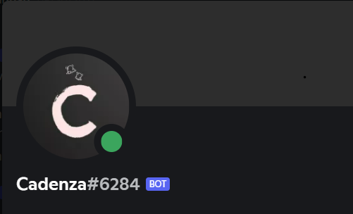

# Cadenza


> Cadenza is a Discord Bot with music playability and server manageability.
## Features

### Moderation
#### /botping
```
Shows the bot's average ping
```
#### /join
```
Joins the channel as user!
```
#### /leave
```
Disconnects the bot
```
#### /delete
```
Delete messages in bulk [1-99]
```
#### /userinfo
```
Provides information about the user
```

### Music

#### /loop
```
Toogle looping
```
#### /lyrics or /ly
```
Generates the lyrics for the given song
```
#### /move
```
Moves a song to the beginning or to a selected position in the queue
```
#### /nowplaying or /np
```
returns the song currently being played
```
#### /pause or /pa
```
Pause the current song
```
#### /play [song-name]
```
Plays a song from the given URL

```
#### /playfrom
```
Plays a song from the given number in the queue
```
#### /playlist or /pl
```
Plays a youtube playlist
```
#### /queue or /q
```
Show the music queue
```
#### /remove
```
remove a song from queue
```

#### /replay or /re
```
Plays the current song from beginning
```
#### /seek
```
Seeks to a certain point in the current track
```
#### /shuffle
```
Shuffles the queue
```
#### /skip or /s 
```
Skips the current song
```
#### /skipto [no.]
```
Skips to the given song number.
```
#### /stop
```
Stops the music.
```
#### /volume
```
Change the volume of bot
```

## Requirements
1. Discord Bot Token
2. Youtube API Key
3. Node.js v12.0.0 or later

## Installation
```
git clone https://github.com/Artistic18/Cadenza
cd Cadenza
npm install
```

## Getting started with the project.

**1.**  Fork [this](https://github.com/Artistic18/Cadenza) repository.

**2.**  Clone your forked copy of the project.

```
git clone https://github.com/<your_user_name>/Cadenza
```

**3.** Add a reference(remote) to the original repository.

```
git remote add upstream https://github.com/codedazzlers/DSA-Bootcamps.git
```

**4.** Perfom your desired changes to the code base.

**5.** Track your changes:heavy_check_mark: .

```
git add . 
```

**6.** Commit your changes .

```
git commit -m "comment"
```

**7.** Push the committed changes in your feature branch to your remote repo.

```
git push 
```

**8.** To create a pull request, click on `compare and pull requests`.

**9.** Add appropriate title and description to your pull request explaining your changes and efforts done.

**10.** Click on `Create Pull Request`.

**11.** Voila :exclamation: You have made a PR to the Registration-Portal- :boom: . Wait for your submission to be accepted and your PR to be merged.


